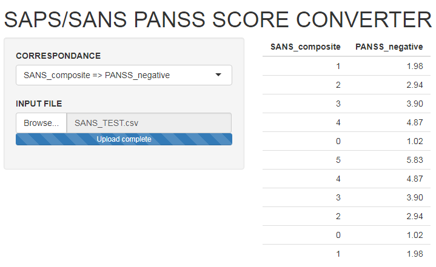
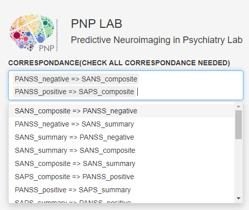
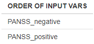
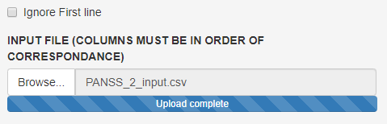
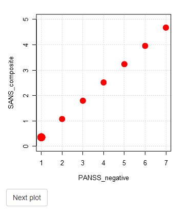
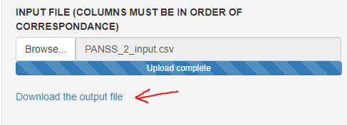

# SANS/SAPS and PANSS score converter
{width=1000px}

## How to make a correspondance between SANS/SAPS and PANSS score

### Step 1: Choose the correspondence needed. 
{width=400px}

### Step 2: Check the order of input variables.

### Step 3: 

### 1. Select a csv (comma separated variables) input file that has the same number of columns than the number of input variables described at step 2. 

### 2. Check the `Ignore First Line` check box if you have names header at the top of your input file so the app can skip the first line. 
	

### At this point you will see the correspondance requested appears on the right of the screen. 

### You can toggle between plot to see all graphical representation of correspondance. 

### Step 4: The correspondance can be downloaded as a new csv file. 

### This is how scores were calculated: 

1. PANSS Positive symptoms

	a. `PANSS_positive = mean(PANSS01-PANSS07)`
	
	b. `PANSS_pos_it1_5_6_7 = mean(PANSS01, PANSS05 - PANSS07)` 
	
	c. `PANSS_pos_it2 = PANSS02` 
	
	d. `PANSS_pos_it_3 = PANSS03`
		
2. PANSS Negative symptoms	

	a. `PANSS_negative = mean(PANSS08-PANSS14)`
	
	b. `PANSS_neg_it8_10_13 = mean(PANSS08, PANSS10, PANSS13)` 
	
	c. `PANSS_neg_it9_11 = mean(PANSS09, PANSS11)`
	
	d. `PANSS_neg_it12 = mean(PANSS12)`
	
3. SAPS Positive symptoms

	a. `SAPS_composite = mean(SAPS01 - SAPS06, SAPS08 - SAPS19,
	                          SAPS21 - SAPS24, SAPS26 - SAPS33))` 
							  
	b. `SAPS_summary = mean(SAPS07, SAPS20, SAPS25, SAPS34)` 

	c. `SAPS_pos_it_20 = SAPS20` 

	d. `SAPS_pos_it_25_34 = mean(SAPS25, SAPS34)` 

	e. `SAPS_pos_it_7 = SAPS07`
	

4. SANS Negative symptoms
	
	a. `SANS_composite = mean(SANS01 - SANS07, SANS09 - SANS12, SANS14 - SANS16, 
	                         SANS18 - SANS21, SANS23 - SANS24)`
							 
	b. `SANS_summary = mean(SANS01, SANS13, SANS17, SANS22, SANS25)`
	
	c. `SANS_neg_it8_13 = mean(SANS08, SANS13)`
	
	d. `SANS_neg_it17_22 = mean(SANS17, SANS22)`
	
	e. `SANS_neg_it25 = SANS25`

