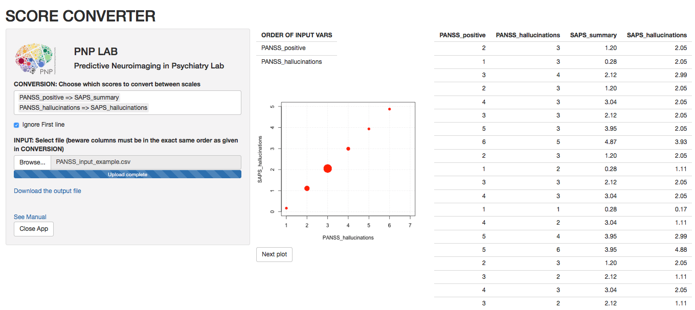

# PANSS and SAPS/SANS (sub)scores converter

This Shiny app (http://shiny.rstudio.com) converts scores between the Positive and Negative Syndrome Scale (PANSS; Kay et al., 1987, Schizophr Bull, 13: 261-276) and the Scale for the Assessment of Positive Symptoms or Scale for the Assessment of Negative Symptoms (SAPS/SANS; Andreasen, 1984, 1983, University of Iowa). Beyond mere conversions for global positive and negative symptoms severity scores, the app allows converting positive (delusions, disorganization, hallucinations) and negative (amotivation, expressivity, cognition) subscores between scales, as described in Grot et al, 2019, PsychArXiv (DOI).  

Interactive conversion equations are available in the software R through the Shiny package: **_install.packages("shiny")_** and **_install.packages("shinyjs")_**. Scores conversion between scales will be performed using the following command line: **_shiny::runGitHub("pnplab/convert_app")_**.

## Procedure

1. Choose all conversions you wish to perform by selecting from the list of possible options, either from PANSS to SAPS/SANS or SAPS/SANS to PANSS, and either for total positive/negative scores or subscores (delusions, disorganization, hallucinations, amotivation, expressivity, cognition).

2. Select a csv (comma separated variables) input file that has the same number of columns than the number of input variables. Moreover, make sure that the order of columns must be in the exact same order as the list of input variables. Check the `Ignore First Line` check box if you have names header at the top of your input file so the app can skip the first line.

3. The requested converted scores will appear in a table at the right of the interface. The first columns are the input variables while the last columns provide the output variables. You can toggle between plots to visualize graphical representations of the conversions. A larger circle reflects an increased proportion of subjects with a given score. Converted scores can be downloaded as a new csv file with `Download the output file`.

## (Sub)scores computation   

**PANSS Positive symptoms**  
PANSS_positive = mean(PANSS01-PANSS07)  
PANSS_delusions = mean(PANSS01, PANSS05 - PANSS07)   
PANSS_disorganization = PANSS02  
PANSS_hallucinations = PANSS03  
		
**PANSS Negative symptoms**  
PANSS_negative = mean(PANSS08-PANSS14)  
PANSS_amotivation = mean(PANSS08, PANSS10, PANSS13)   
PANSS_expressivity = mean(PANSS09, PANSS11)  
PANSS_cognition = mean(PANSS12)  
	
**SAPS Positive symptoms**  
SAPS_composite = mean(SAPS01 - SAPS06, SAPS08 - SAPS19, SAPS21 - SAPS24, SAPS26 - SAPS33))   
SAPS_summary = mean(SAPS07, SAPS20, SAPS25, SAPS34)  
SAPS_delusions = SAPS20   
SAPS_disorganization = mean(SAPS25, SAPS34)   
SAPS_hallucinations = SAPS07  
	
**SANS Negative symptoms**  
SANS_composite = mean(SANS01 - SANS07, SANS09 - SANS12, SANS14 - SANS16, SANS18 - SANS21, SANS23 - SANS24)  
SANS_summary = mean(SANS01, SANS13, SANS17, SANS22, SANS25)  
SANS_amotivation = mean(SANS08, SANS13)  
SANS_expressivity = mean(SANS17, SANS22)  
SANS_cognition = SANS25  

## Regression coefficients

PANSS_positive		=	1.499	+	1.079	*	SAPS_composite 
PANSS_positive		=	1.325	+	0.631	*	SAPS_summary  
PANSS_negative		=	1.016	+	0.962	*	SANS_composite  
PANSS_negative		=	0.953	+	0.753	*	SANS_summary  
PANSS_delusions		=	1.265	+	0.494	*	SAPS_delusions  
PANSS_disorganization	=	1.234	+	0.979	*	SAPS_disorganization  
PANSS_hallucinations	=	1.235	+	0.859	*	SAPS_hallucinations  
PANSS_amotivation	=	0.977	+	0.752	*	SANS_amotivation  
PANSS_expressivity	=	0.698	+	0.843	*	SANS_expressivity  
PANSS_cognition		=	2.455	+	0.436	*	SANS_cognition  

SAPS_composite		=	-0.543	+	0.528	*	PANSS_positive  
SAPS_summary		=	-0.637	+	0.918	*	PANSS_positive  
SANS_composite		=	-0.370	+	0.721	*	PANSS_negative  
SANS_summary		=	-0.363	+	0.883	*	PANSS_negative  
SAPS_delusions		=	-0.849	+	1.293	*	PANSS_delusions  
SAPS_disorganization	=	-0.245	+	0.481	*	PANSS_disorganization  
SAPS_hallucinations	=	-0.773	+	0.941	*	PANSS_hallucinations  
SANS_amotivation	=	-0.541	+	0.907	*	PANSS_amotivation  
SANS_expressivity	=	0.430	+	0.677	*	PANSS_expressivity  
SANS_cognition		=	0.492	+	0.329	*	PANSS_cognition  

